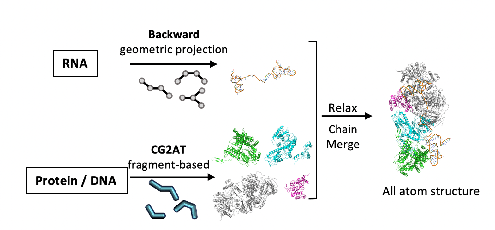

# CG2AT2+Backward
This repository provides a workflow that integrates both Backward and CG2AT2 backmapping methods, enabling the conversion of Martini coarse-grained models to all-atom structures for protein–nucleic acid systems.
[CG2AT2](https://github.com/owenvickery/cg2at.git) is a fragment-based approach used for backmapping proteins and DNA chains. Since fragment libraries for RNA are not available, RNA chains are backmapped using the geometric-based [Backward](https://github.com/Tsjerk/Backward.git) protocol.

## Installation

Software:

- Python v3 or higher
- GROMACS > v5

Non standard python modules:

- Numpy
- Scipy


## Usage
We use the arm domain of the yeast spliceosomal U4/U6·U5 tri-snRNP (PDB ID: 5GAN) as an example to illustrate the usage.

`cd test`

### (Optional) Setting the Simulation Box
To prevent issues caused by missing box information or a box that is too small, we first regenerate the box using:

`{GMX} editconf -f $input.pdb -o $output_box.pdb -d 1.0 -bt cubic`

where ${GMX} should be replaced by your path to gmx / gmx_mpi.

### Backmapping to All-Atom Structure:
`python ../database/bin/cg2at_backward.py -c $output_box.pdb -w tip3p 
-fg martini_2-2_charmm36_Jul2021 -ff charmm36-jul2021 -loc $output_dir -silent -rna_ff charmm36`

To use this script, just type `python ../database/bin/cg2at_backward.py -h` to see the help message.

Outputs a directory that contains
```
	| -- FINAL
			| -- final_cg2at_de_novo.pdb
			...
	| -- INPUT
      | -- CG_INPUT.pdb
			...
	| -- MERGE
      | -- MIN
      | -- NVT
			...
  | -- PROTEIN
      | -- MIN
  | -- RNA
      | -- MIN
```

`INPUT`: Contains the input Martini coarse-grained structure.

`CG_INPUT.pdb` serves as the initial structure for subsequent calculations.

`PROTEIN` \ `RNA`: Contains the backmapped structures and topology files for each protein or RNA chain. The energy-minimized results for each chain are stored in the `MIN` directory.

`MERGE`: Contains the merged structures and topology files for all chains.
The energy-minimized and NVT simulation results for the complete system are stored in the  `MIN` and `NVT` directories, respectively.

`FINAL`: Stores the final results. `final_cg2at_de_novo.pdb` is the final all-atom structure.

### (Optional) Fixing Chain ID
Since the PDB files generated by GROMACS lack chain ids, they can be fixed by:

`echo -e "1\n1\n0" | gmx_mpi trjconv -f $output/FINAL/final_cg2at_de_novo.pdb -s $output/MERGED/NVT/merged_cg2at_de_novo_nvt.tpr -o $output/FINAL/final_cg2at_de_novo_fixed.pdb -pbc cluster -center`

## Citations
If you use this package, please cite:
```
@article{wassenaar2014backward,
  title        = {Going Backward: A Flexible Geometric Approach to Reverse Transformation from Coarse Grained to Atomistic Models},
  author       = {Wassenaar, Tsjerk A. and Pluhackova, Kristyna and B{\"o}ckmann, Rainer A. and Marrink, Siewert J. and Tieleman, D. Peter},
  journal      = {Journal of Chemical Theory and Computation},
  volume       = {10},
  pages        = {676--690},
  year         = {2014},
  doi          = {10.1021/ct400617g}
}

@article{vickery2021cg2at2,
  title        = {CG2AT2: An Enhanced Fragment-Based Approach for Serial Multi-scale Molecular Dynamics Simulations},
  author       = {Vickery, Owen N. and Stansfeld, Phillip J.},
  journal      = {Journal of Chemical Theory and Computation},
  volume       = {17},
  number       = {10},
  pages        = {6472--6482},
  year         = {2021},
  doi          = {10.1021/acs.jctc.1c00295}
}
 
@article{zhang2025cryodynamultiscaleendtoendmodeling,
      title={CryoDyna: Multiscale end-to-end modeling of cryo-EM macromolecule dynamics with physics-aware neural network}, 
      author={Chengwei Zhang and Shimian Li and Yihao Niu and Zhen Zhu and Sihao Yuan and Sirui Liu and Yi Qin Gao},
      year={2025},
      eprint={2510.16510},
      archivePrefix={arXiv},
      primaryClass={q-bio.BM},
      url={https://arxiv.org/abs/2510.16510},
}
```